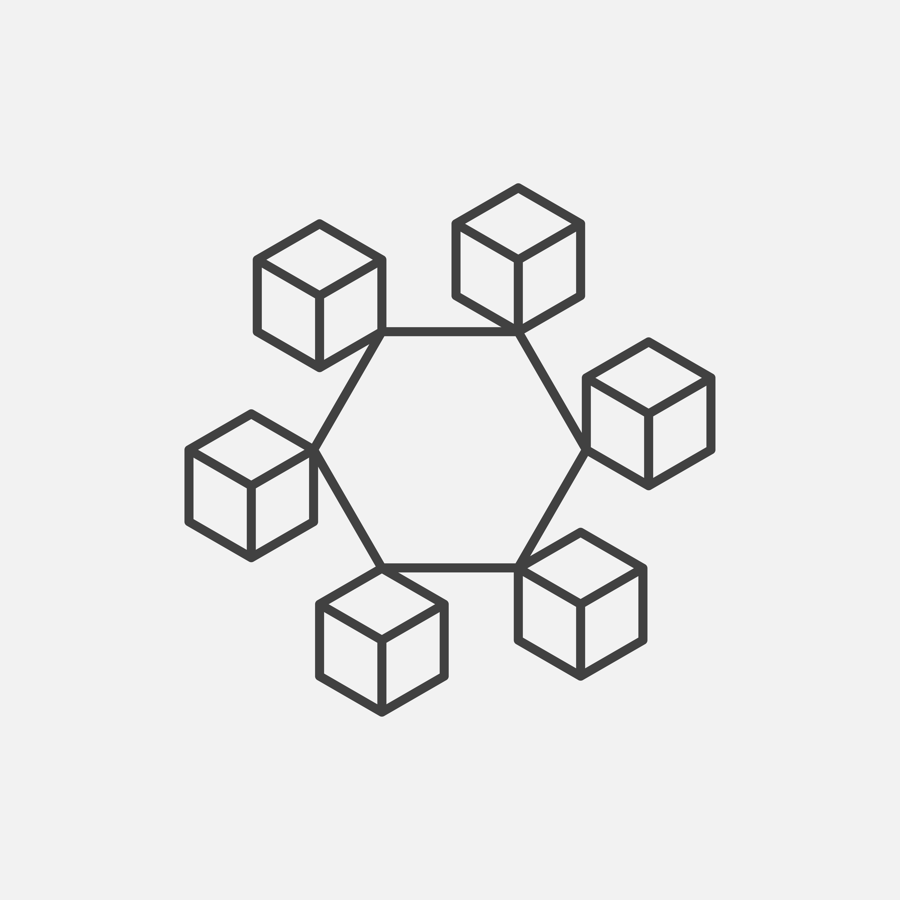

# YamiChain


Open ledger DApp for information sharing across loan providers
Powered by blockchain technology

<p align="center">
  
</p>

## Installation

- Use the package manager [npm](https://www.npmjs.com/) to install dependencies for the frontend app (React).

- Install [Ganache](https://www.trufflesuite.com/docs/ganache/quickstart) to simulate a blockchain locally

- Install [Truffle suite](https://www.trufflesuite.com/docs/truffle/getting-started/installation) to compile and deploy contracts to the local blockchain

- Install [MetaMask Wallet](https://metamask.io/)


## Running the app

```bash
./deploy
```
